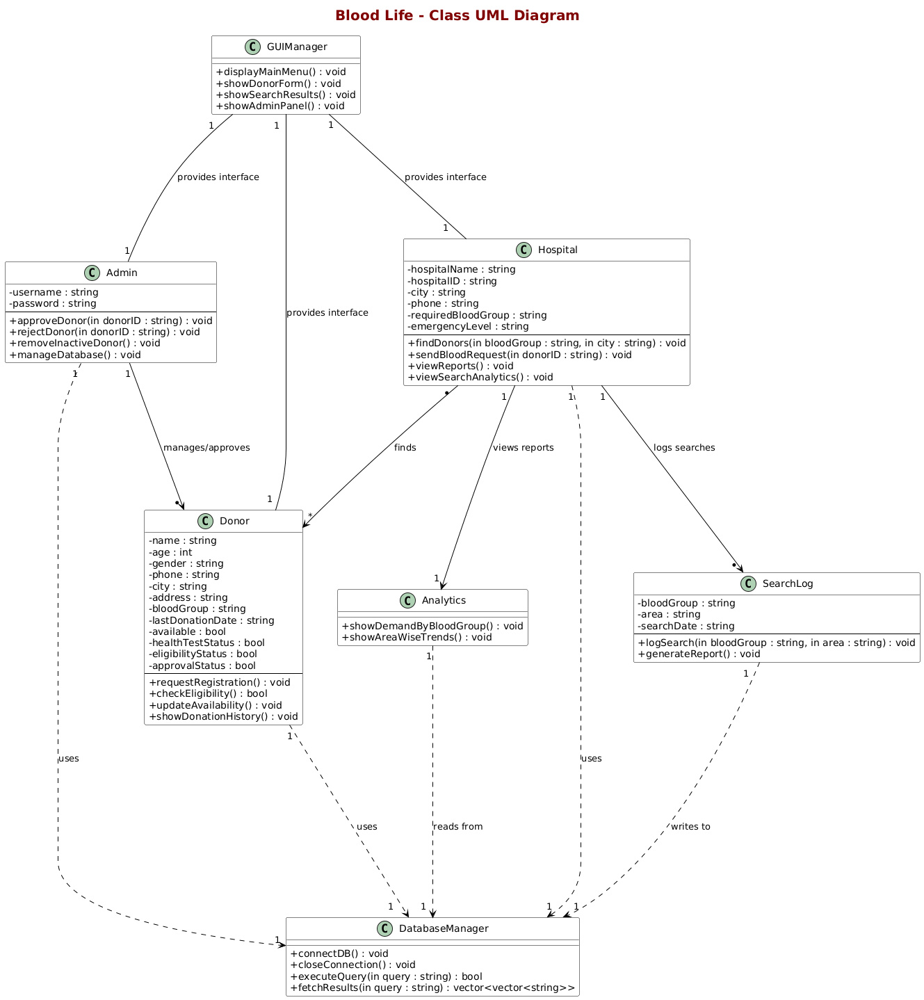

# Blood Life

**A Smart Blood Donor Management System**

[](https://isocpp.org/)
[](https://www.qt.io/)
[](https://www.mysql.com/)

Blood Life is an intelligent blood donor management application that connects hospitals with verified blood donors during emergencies. Built with C++, Qt, and MySQL, it implements a multi-stage verification and availability system to ensure critical time is not wasted during life-threatening situations.

---

## Table of Contents

- [Overview](#overview)
- [Problem Statement](#problem-statement)
- [Solution](#solution)
- [Core Features](#core-features)
- [System Architecture](#system-architecture)
- [Technology Stack](#technology-stack)
- [User Workflows](#user-workflows)
- [Benefits](#benefits)
- [Future Enhancements](#future-enhancements)
- [Team](#team)

---

## Overview

Blood Life addresses the critical challenge of connecting blood donors with hospitals efficiently. The system implements three key innovations:

1. **Admin Approval System** - Ensures only verified donors are in the database
2. **Real-Time Availability** - Donors control when they're ready to donate
3. **Smart Filtering** - Multi-stage verification prevents wasted time during emergencies

---

## Problem Statement

### Current Challenges

**Unorganized Communication**
- Manual phone calls to find donors waste precious time
- Donor information scattered across paper records with no centralization
- No verification system to authenticate donor information
- Risk of contacting fraudulent or unreliable sources

**Donor Status Uncertainty**
- No tracking of 90-day mandatory rest period between donations
- No visibility into donor availability (busy, sick, traveling)
- Time wasted contacting ineligible or unavailable individuals

**Lack of Strategic Planning**
- No data on blood type demand patterns
- Cannot predict shortages or plan donation camps effectively
- Inefficient resource allocation

### Impact

These challenges result in delayed blood availability for patients, wasted hospital resources, and inability to plan proactive blood collection strategies.

---

## Solution

Blood Life implements a three-stage intelligent filtering system:

```
Registration → Admin Approval → Availability Control → Smart Search
```

### Three-Layer Verification

When hospitals search for donors, the system automatically applies:

1. **Approval Filter** - `approvalStatus = TRUE` (Admin-verified only)
2. **Availability Filter** - `available = TRUE` (Currently available)
3. **Match Filter** - Blood type and location matching

Result: Hospitals receive a refined list of verified, available, eligible donors instantly.

---

## Core Features

### 1. Donor Registration & Approval

**Registration Process**
- Donors submit registration with personal details and blood type
- System validates data completeness and accuracy
- Request enters pending approval queue

**Admin Approval Workflow**
- Admins review pending registrations
- Approve or reject with reason tracking
- Only approved donors gain system access

**Availability Toggle**
- Approved donors control their availability status
- Simple toggle: Available / Unavailable
- Updates reflected in real-time searches

### 2. Hospital Search Interface

**Multi-Stage Filtering**

The system applies automatic filters in sequence:
- Stage 1: Verified donors only (`approvalStatus = TRUE`)
- Stage 2: Currently available (`available = TRUE`)
- Stage 3: Blood type and location match

Hospitals see only donors who meet all three criteria, eliminating wasted contacts.

### 3. Admin Management Panel

- Review and process registration requests
- Remove inactive or relocated donors
- View statistics by blood group and region
- Monitor approval/rejection rates
- Maintain database quality

### 4. Eligibility Tracking

**90-Day Rule Implementation**
- Automatic recording of donation dates
- Calculation of next eligible donation date
- Status updates after rest period completion
- Prevention of premature donation requests

**Health Check Management**
- Medical test completion tracking
- Health test expiration monitoring
- Safety compliance for donors and recipients

### 5. Donation History

Complete tracking of:
- Date, location, and hospital for each donation
- Total donations per donor
- Donation frequency patterns
- Recognition for frequent contributors

### 6. Analytics & Reporting

**Monthly Analytics**
- Blood group demand trends
- Geographic demand patterns
- Seasonal variation analysis
- Comparative period analysis

**Strategic Planning Reports**
- Donation camp scheduling optimization
- High-demand blood type identification
- Donor recruitment targeting
- Resource allocation insights

---

## System Architecture

### Class Structure

The system uses independent, modular classes:

- **Donor Class** - Registration and availability management
- **Hospital Class** - Blood search functionality
- **Admin Class** - Approval and verification processes
- **DatabaseManager Class** - Database operations
- **SearchLog Class** - Search pattern tracking
- **Analytics Class** - Report generation
- **GUIManager Class** - Role-based user interfaces

### UML Diagram



---

## Technology Stack

| Component | Technology | Purpose |
|-----------|-----------|---------|
| Language | C++ | Core application logic |
| GUI Framework | Qt | Cross-platform interface |
| Database | MySQL | Secure data storage |
| Design Pattern | Object-Oriented | Modular architecture |

**Technology Rationale**
- **C++** provides performance and efficiency for desktop applications
- **Qt** enables native, cross-platform GUI development
- **MySQL** offers reliable, secure database management
- **OOP Design** ensures maintainability and extensibility

---

## User Workflows

### Donor Workflow

```
1. Submit Registration
2. Await Admin Approval
3. Receive Access (if approved)
4. Toggle Availability Status
5. Respond to Hospital Contacts
6. Donate Blood
7. Automatic 90-Day Rest Period
8. Regain Eligibility
```

### Hospital Workflow

```
1. Enter Search Criteria (Blood Type + Location)
2. System Applies Three Filters
3. View Verified, Available Donors
4. Contact Donors
5. Coordinate Donation
```

### Admin Workflow

```
1. Review Pending Registrations
2. Verify Donor Information
3. Approve or Reject Applications
4. Monitor Database Quality
5. Generate Analytics Reports
6. Manage Inactive Donors
```

---

## Benefits

### For Hospitals
- Instant access to verified, available donors
- Elimination of wasted contact attempts
- Data-driven planning for blood drives
- Improved emergency response times

### For Donors
- Control over availability status
- Protected rest periods
- Recognition for contributions
- Verified, trustworthy system

### For Administrators
- Quality-controlled database
- Automated eligibility management
- Strategic insights from analytics
- Efficient donor verification process

### For Patients
- Faster blood availability in emergencies
- Safety through verified donor network
- Higher success rates in critical situations

---

## Future Enhancements

### Technical Improvements
- Mobile application development for iOS and Android
- SMS/Email automated alert system
- Web-based portal for cross-device access
- Biometric authentication integration

### Advanced Features
- AI-powered demand prediction models
- Hospital management system integration
- Geolocation-based nearest donor identification
- Appointment scheduling functionality

### Engagement Features
- Achievement and recognition system
- Impact tracking and visualization
- Multi-language support
- Push notification system
- Automated reminder system

---

## Team

**Project Contributors**

- Deversh Shetgaonkar (2302)
- Atharv Gawas (2313)
- Shripad Chodankar (2317)

---

## Conclusion

Blood Life transforms blood donor management from a manual, time-consuming process into an intelligent, efficient system. Through three-layer verification, real-time availability control, and comprehensive analytics, the application ensures the right donor is connected at the right moment—potentially saving lives in critical situations.

---

## License

This project is part of an TY academic Project.

---

**Blood Life** | Intelligent Blood Donor Management
